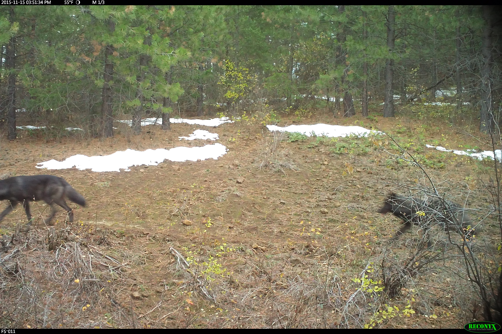
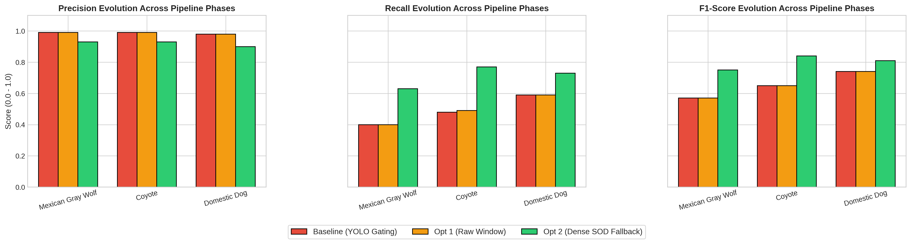
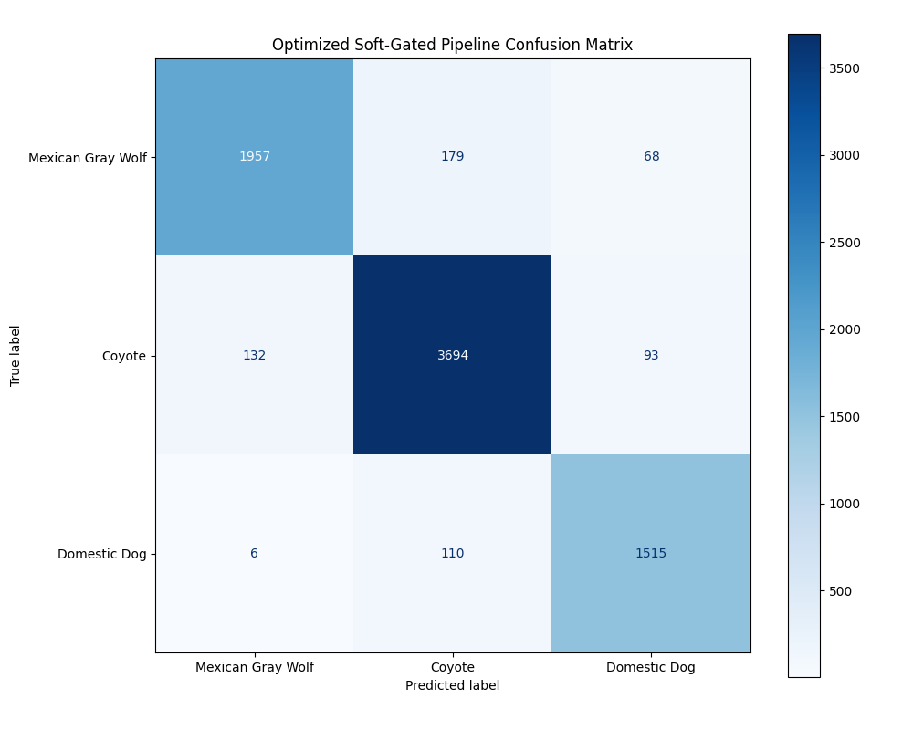

# Mexican-Gray-Wolf-Recognition-Model

A multi-stage, cost-sensitive computer vision pipeline engineered to automate population monitoring of the endangered Mexican Gray Wolf (*Canis lupus baileyi*). The system addresses the dual challenges of extreme environmental noise (camouflage, dense brush, low-light conditions) and high phenotypic similarity among sympatric canids by decoupling spatial localization, salient background removal, and parallel dual-attention feature extraction.


---

## System Design and Architecture

Instead of forcing a single model to handle localization and fine-grained classification simultaneously, this system implements a strict three-stage cascaded inference framework optimized for edge deployment on remote trail camera configurations.


1. **Stage 1: Spatial Gating and Localization (YOLOv8)** – Drops an anchor-free bounding box around regional areas of interest. Operates at an empirically calculated static threshold of `0.25` to filter out empty scenery frames early, saving massive computational overhead.
2. **Stage 2: Salient Edge Matting and Background Stripping (BiRefNet)** – Extracts the region crop and applies Salient Object Detection (SOD). Gradients are processed via a vectorized NumPy mask-hardener ($\alpha > 128$) to yield a cohesive animal silhouette, eliminating structural fragmentation failures common in edge-discontinuity models.
3. **Stage 3: Fine-Grained Classification (Dual-Attention Network)** – Processes the clean silhouette through a parallel architecture. The **Spatial Attention Head** maps macro-skeletal proportions (snout-to-ear ratios) to combat partial occlusions, while the **Spectral Attention Head** operates in the frequency domain to track micro-biological cues (fur coat texture density, guard hair distributions).

---

## The Architectural Optimization: Soft-Gating Fallback

A common point of failure for cascades in the field is the **"Matting Collapse"** or severe true-negative dropouts under extreme environmental constraints (e.g., highly camouflaged coats or night-time infrared captures). If Stage 1 fails to find a high-confidence bounding box, traditional pipelines drop the frame entirely. 

To break past this recall bottleneck, this repository implements a **Dense Salient Fallback Route**:

```text
[YOLOv8 Gating Fails] 
        │
        ▼
[Extract Generous 85% Frame Area] 
        │
        ▼
[Direct Ingestion by BiRefNet SOD Session] ──► [Isolates High-Contrast Animal Silhouette]
                                                                  │
                                                                  ▼
                                                      [Dual-Attention Evaluation]
```

---

## Empirical Findings and Research Performance

1. **Multi-Panel Performance Metrics Evaluation**


By deploying the Dense Salient Fallback configuration across a large validation set ($N = 10,000$), we successfully eliminated catastrophic frame drops while vastly extending the system's tracking capabilities.
- The Recall Breakthrough: Bypassing a fragile regional sliding window in favor of direct broad saliency processing caused Mexican Gray Wolf recall to leap from $0.40$ to $0.63$ (a $+23\%$ vertical improvement).
- The Precision/Recall Equilibrium: While the system takes on highly ambiguous edge-case frames through the fallback route (resulting in a minor $\sim6\%$ normalization adjustment in precision), the overall macro F1-score rose significantly from $0.65 \rightarrow 0.80$.
  
2. Post-Optimization Confusion Matrix


The final classification breakdown demonstrates remarkable stability across sympatric canids, showing elite precision limits ($>0.90$) and clear fine-grained differentiation bounds.

